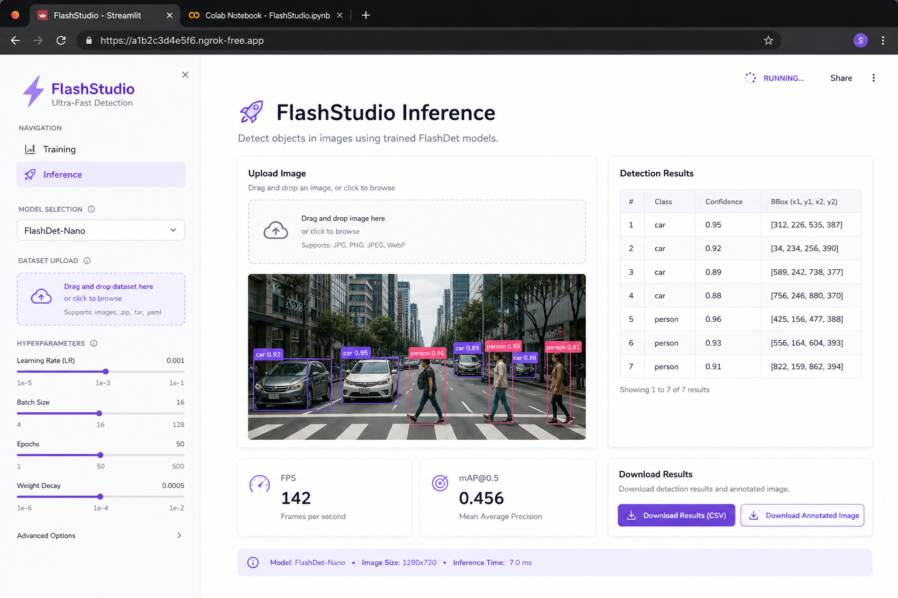
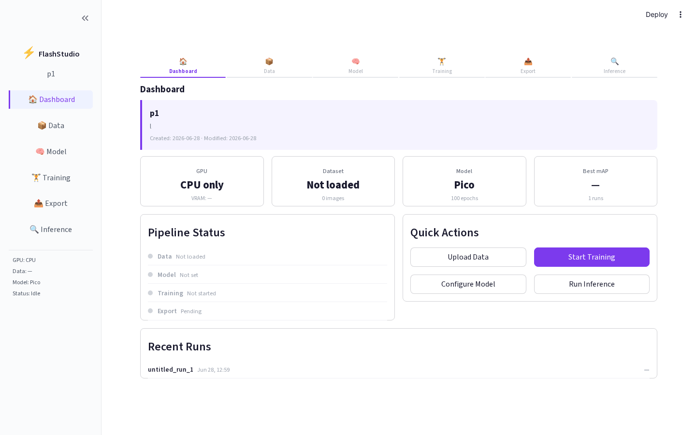
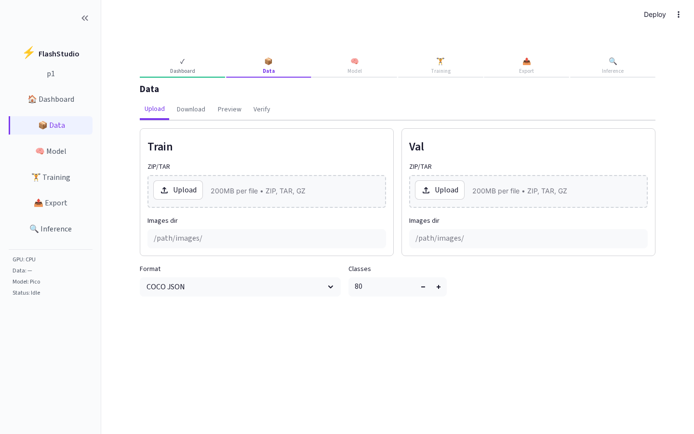
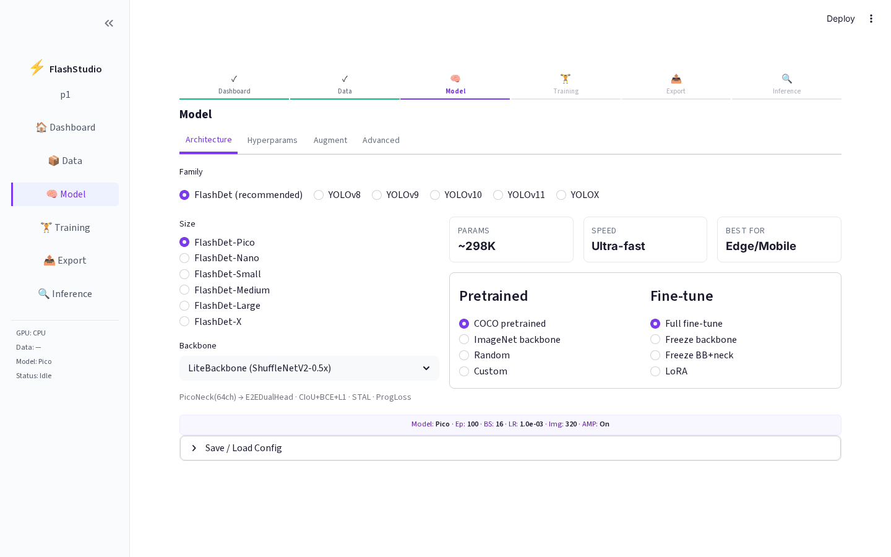
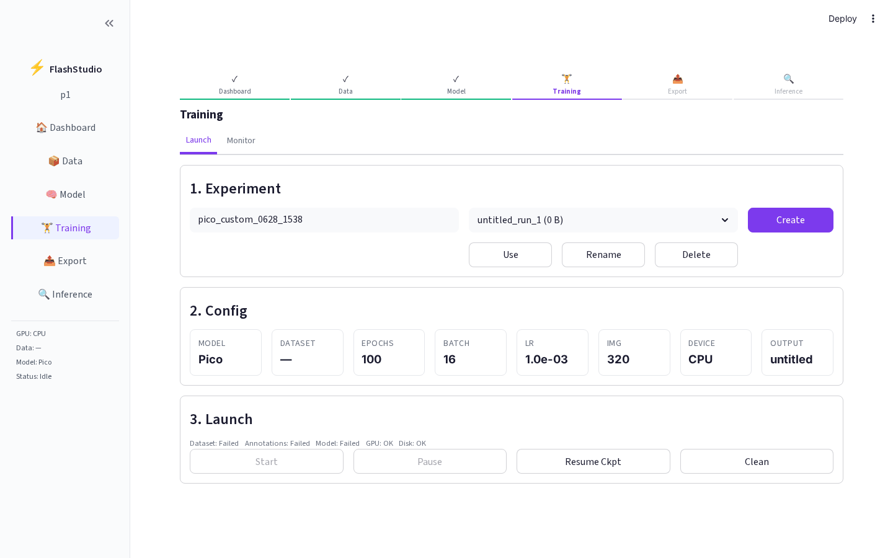
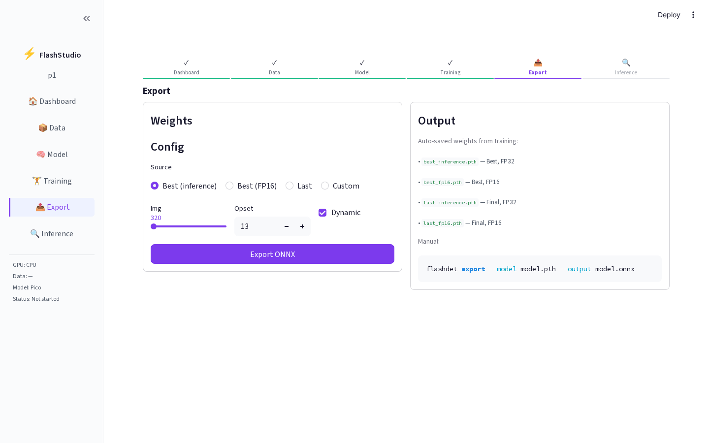
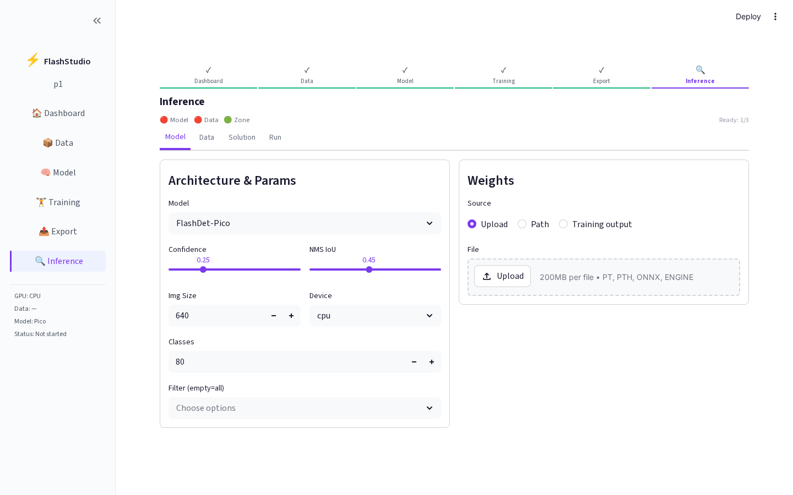

<p align="center">
  
</p>

<h1 align="center">FlashStudio</h1>

<p align="center">
  <a href="https://pypi.org/project/flashstudio/"></a>
  
  
  
  
</p>

<p align="center">
  <b>Interactive Training & Inference UI for FlashDet — runs locally or on Google Colab with a Streamlit interface.</b>
</p>

<p align="center">
  
</p>

## Features

- 🏋️ **Training Dashboard** — Real-time monitoring with live loss curves, per-epoch visualizations, GT verification
- 🧠 **Model Config** — All 6 FlashDet sizes + YOLOv8/v9/v10/v11/YOLOX with accurate params
- 🔍 **Inference Pipeline** — 4-step wizard: Model → Data → Zone → Run (17 solutions, 6 trackers)
- 📤 **Export** — ONNX export with FP16 auto-generated weights
- 📦 **Data** — Native `flashdet download` datasets + custom upload (COCO/VOC/YOLO formats)
- 📊 **Dashboard** — Overview with recent training runs from workspace
- 🚀 **Colab Support** — ngrok tunneling for remote access

---

## UI Tour

### Dashboard
Project overview with key metrics (GPU, Dataset, Model, mAP), pipeline status, quick actions, and recent training runs.

<p align="center">
  
</p>

### Data Management
Upload datasets (ZIP/TAR), download from `flashdet` registry, preview images with navigation, and verify annotations.

<p align="center">
  
</p>

### Model Configuration
Choose from 6 FlashDet sizes + YOLO variants. Configure hyperparameters, augmentations, and advanced settings (memory optimization, distributed training).

<p align="center">
  
</p>

### Training
Create experiments, launch training with preflight checks, and monitor runs with real-time curves, visualizations, ground truth, logs, and file browser.

<p align="center">
  
</p>

### Export
Export trained models to ONNX format with configurable opset, image size, and dynamic batching. Auto-detects saved weights from training.

<p align="center">
  
</p>

### Inference
Full inference pipeline with 17 built-in solutions (object counting, speed estimation, heatmaps, security alarms, etc.). Interactive zone drawing with Polygon, Rectangle, and Line tools.

<p align="center">
  
</p>

---

## Installation

### Step 1: Install FlashStudio

```bash
pip install flashstudio
```

### Step 2: Install FlashDet (required for training/inference)

```bash
pip install git+https://github.com/FlashVision/FlashDet.git
```

### Development install (from source)

```bash
git clone https://github.com/FlashVision/FlashStudio.git
cd FlashStudio
pip install -e .
```

---

## Usage — Local Machine

### Option 1: CLI

```bash
flashstudio --port 8501
```

### Option 2: Streamlit directly

```bash
cd FlashStudio
streamlit run flashstudio/app.py
```

Then open **http://localhost:8501** in your browser.

---

## Usage — Google Colab

### Step 1: Install packages

```python
!pip install flashstudio
!pip install git+https://github.com/FlashVision/FlashDet.git
```

### Step 2: Get ngrok token (free, one-time setup)

FlashStudio uses [ngrok](https://ngrok.com) to create a public URL for the Streamlit UI in Colab.

1. **Sign up** (free): https://dashboard.ngrok.com/signup
2. **Get your auth token**: https://dashboard.ngrok.com/get-started/your-authtoken
3. Copy the token (looks like `2xAbC1234_something...`)

### Step 3: Launch

```python
from flashstudio import launch

# Pass your ngrok token
launch(ngrok_token="YOUR_NGROK_TOKEN_HERE")
```

Or set it as an environment variable:

```python
import os
os.environ["NGROK_TOKEN"] = "YOUR_NGROK_TOKEN_HERE"

from flashstudio import launch
launch()
```

### Step 4: Open the URL

After launching, you'll see output like:

```
============================================================
  FlashStudio is running!
  Local:  http://localhost:8501
  Public: https://abc123.ngrok-free.app
============================================================
```

Click the **Public URL** to open FlashStudio in a new tab.

---

## Google Colab Notebooks (Ready to Use)

| Notebook | Description | Link |
|----------|-------------|------|
| Training | Train FlashDet models | [](https://colab.research.google.com/github/FlashVision/FlashStudio/blob/main/notebooks/FlashStudio_Train.ipynb) |
| Inference | Run detection on images/video | [](https://colab.research.google.com/github/FlashVision/FlashStudio/blob/main/notebooks/FlashStudio_Inference.ipynb) |

---

## Supported Models

| Model | Params | Best For |
|-------|--------|----------|
| FlashDet-Pico | ~298K | Edge / MCU |
| FlashDet-Nano | ~790K | Embedded / IoT |
| FlashDet-Small | ~1.8M | General purpose |
| FlashDet-Medium | ~3.6M | High accuracy |
| FlashDet-Large | ~5.8M | High accuracy |
| FlashDet-X | ~9.0M | Max accuracy / Server |
| YOLOv8/v9/v10/v11/YOLOX | Varies | General YOLO |

---

## Architecture

```
FlashStudio/
├── flashstudio/
│   ├── __init__.py                  # Package init + launch() export
│   ├── app.py                       # Main Streamlit app (wizard flow)
│   ├── launcher.py                  # Colab/local launcher with ngrok
│   ├── cli.py                       # CLI entrypoint
│   ├── constants.py                 # Centralized constants (paths, defaults, models)
│   │
│   ├── pages/                       # Each page is a sub-package
│   │   ├── dashboard/
│   │   │   ├── page.py              # Main dashboard render
│   │   │   ├── pipeline_status.py   # Pipeline status cards
│   │   │   └── recent_runs.py       # Recent training runs table
│   │   ├── data/
│   │   │   ├── page.py              # Main data page render
│   │   │   ├── upload.py            # Upload tab (ZIP/TAR + class config)
│   │   │   ├── download.py          # Download tab (quick start + registries)
│   │   │   ├── preview.py           # Preview tab (image grid + annotations)
│   │   │   ├── verify.py            # Verify tab (dataset validation)
│   │   │   └── helpers.py           # Shared helpers (extract, detect, convert)
│   │   ├── model/
│   │   │   ├── page.py              # Main model page render
│   │   │   ├── architecture.py      # Architecture tab (FlashDet/YOLO selection)
│   │   │   ├── hyperparams.py       # Hyperparameters tab
│   │   │   ├── augmentation.py      # Augmentation tab
│   │   │   ├── advanced.py          # Advanced tab (memory, distributed)
│   │   │   └── summary.py           # Config summary bar + YAML save/load
│   │   ├── training/
│   │   │   ├── page.py              # Main training page render
│   │   │   ├── _common.py           # Shared utilities (_get_save_dir)
│   │   │   ├── launch/              # Launch sub-package
│   │   │   │   ├── tab.py           # Launch tab entry point
│   │   │   │   ├── preflight.py     # Pre-flight checks
│   │   │   │   ├── runner.py        # FlashDet Trainer subprocess
│   │   │   │   ├── controls.py      # Start/stop/pause/resume buttons
│   │   │   │   └── dialogs.py       # Clean/resume/config dialogs
│   │   │   └── monitor/             # Monitor sub-package
│   │   │       ├── tab.py           # Monitor tab entry point
│   │   │       ├── run_meta.py      # Run metadata extraction
│   │   │       ├── parsers.py       # CSV/log parsing
│   │   │       ├── dashboard.py     # Run dashboard + metrics
│   │   │       ├── curves.py        # Plotly training curves
│   │   │       ├── visualizations.py # Epoch visualizations
│   │   │       ├── gt_verification.py # Ground truth verification
│   │   │       ├── log_viewer.py    # Full log viewer
│   │   │       └── checkpoints.py   # File browser + checkpoints
│   │   ├── export/
│   │   │   └── page.py              # Export page (ONNX/TorchScript)
│   │   └── inference/
│   │       ├── page.py              # Main inference page render
│   │       ├── model_tab.py         # Model selection tab
│   │       ├── data_tab.py          # Data input tab (images/video/RTSP)
│   │       ├── solution_tab.py      # Solution selection + zone drawing
│   │       ├── run_tab.py           # Run tab + results display
│   │       ├── detection.py         # Detection utilities (real + demo)
│   │       └── video.py             # Video/image inference runners
│   │
│   ├── components/
│   │   ├── sidebar.py               # Navigation sidebar
│   │   ├── styles.py                # Custom CSS + UI helpers
│   │   ├── wizard.py                # Step indicator + navigation
│   │   ├── project_manager.py       # Project CRUD + state persistence
│   │   └── zone_drawer/             # Interactive canvas zone drawing
│   │
│   └── utils/
│       ├── __init__.py              # Shared helpers (defaults, state, flash)
│       ├── device.py                # GPU/environment detection
│       ├── jobs.py                  # Background process tracking
│       ├── filesystem.py            # Directory size/listing utilities
│       ├── config.py                # Training config build/save/load
│       └── training_hooks.py        # FlashDet training callbacks
│
├── tests/                           # Pytest test suite
│   ├── conftest.py                  # Shared fixtures
│   ├── test_constants.py            # Constants validation
│   ├── test_cli.py                  # CLI tests
│   ├── test_utils/                  # Utils sub-package tests
│   │   ├── test_init.py
│   │   ├── test_device.py
│   │   ├── test_filesystem.py
│   │   ├── test_config.py
│   │   └── test_jobs.py
│   ├── test_pages/                  # Page logic tests
│   │   └── test_training_parsers.py
│   └── test_components/
│       └── test_project_manager.py
│
├── .github/workflows/ci.yml        # GitHub Actions CI
├── notebooks/
├── .streamlit/config.toml
├── pyproject.toml
└── README.md
```

---

## Troubleshooting

### `ModuleNotFoundError: No module named 'pyngrok'`

```bash
pip install --upgrade flashstudio
```

### ngrok authentication error (`ERR_NGROK_4018`)

You need an ngrok auth token. Get one free at:
https://dashboard.ngrok.com/get-started/your-authtoken

Then pass it to `launch(ngrok_token="your_token")`.

### Streamlit port already in use

```bash
# Kill existing Streamlit processes
pkill -f "streamlit run"

# Then restart
flashstudio --port 8501
```

---

## Requirements

- Python >= 3.9
- FlashDet (`pip install git+https://github.com/FlashVision/FlashDet.git`)
- ngrok account (free) for Google Colab usage
- GPU recommended for training (T4 or better)

## License

Apache-2.0
